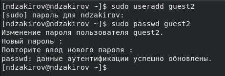
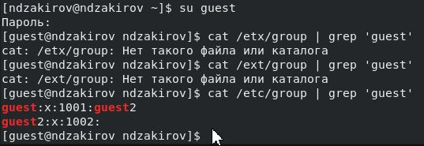
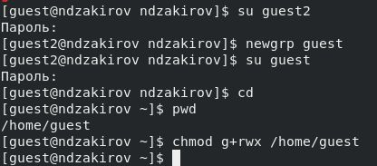
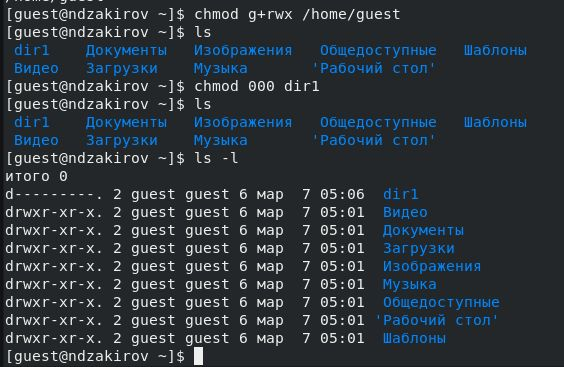
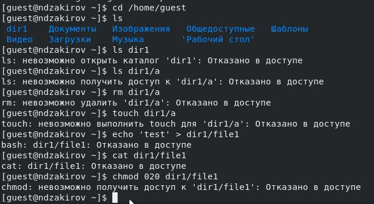

---
## Front matter
lang: ru-RU
title: Презентация по лабораторной работе №3
subtitle: Основы информационной безопасности
author:
  - Закиров Н. Д
institute:
  - Российский университет дружбы народов, Москва, Россия
date: 22 марта 2025

## i18n babel
babel-lang: russian
babel-otherlangs: english

## Fonts
mainfont: PT Serif
romanfont: PT Serif
sansfont: PT Sans
monofont: PT Mono
mainfontoptions: Ligatures=TeX
romanfontoptions: Ligatures=TeX
sansfontoptions: Ligatures=TeX,Scale=MatchLowercase
monofontoptions: Scale=MatchLowercase,Scale=0.9

## Formatting pdf
toc: false
toc-title: Содержание
slide_level: 2
aspectratio: 169
section-titles: true
theme: metropolis
header-includes:
 - \metroset{progressbar=frametitle,sectionpage=progressbar,numbering=fraction}
 - '\makeatletter'
 - '\beamer@ignorenonframefalse'
 - '\makeatother'
---

# Информация

## Докладчик

:::::::::::::: {.columns align=center}
::: {.column width="70%"}

  * Закиров Нурислам Дамирович
  * студентка группы НКАбд-01-22
  * Российский университет дружбы народов

::::::::::::::

## Цель

Получить практические навыки работы в консоли с атрибутами файлов для групп пользователей.

# Выполнение лабораторной работы. 

## Создание пользователей

1. Пользователь guest был создан в лабораторной работе №2, поэтому в этой лабораторной работе его не создаем заново
2. Пароль для пользователя guest тоже был задан в лабораторной работе №2. 
3. С правами администратора создаю пользователя guest с помощью команды `useradd`, далее с помощью команды `passwd` задаю пароль пользователю 
{#fig:001 width=70%}

## Добавление пользователя в группу

4. Добавляю пользователя guest2 в группу guest 

{#fig:002 width=70%}

## Вход с двух консолей

5. Зашёл на двух разных консолях от имени двух разных пользователей с помощью команды `su <имя пользователя>` 

{#fig:003 width=70%}

## Проверка пути директории

6. Проверяю путь директории, в которой я нахожусь с помощью `pwd`.

Проверка для пользователя guest 

{#fig:004 width=70%}

## Проверка пути директории

Проверка для пользователя guest2

{#fig:005 width=70%}

## Проверка данных о пользователях

7. Проверяю имя пользователей с поомощью команды whoami, с помощью команды id могу увидеть группы, к которым принадлежит пользователь и коды этих групп (gid), команда groups просто выведет список групп, в которые входит пользователь.

id -Gn - выведет названия групп, которым принадлежит пользователь

id -G - выведет только код групп, которым принадлежит пользователь. 

## Проверка данных о группах пользователей

8. Вывел интересующее меня содержимое файла etc/group, видно, что в группе guest два пользователя, а в группе guest2 один 

{#fig:008 width=70%}

## Регистрация пользователя в группе

9. От имени пользователя guest2 регистрирую его в группе guest с помощью команды `newgrp` 

{#fig:009 width=70%}

## Изменение прав директории, в которой будем работать

10. Добавляю права на чтение, запись и исполнение группе пользвателей guest (guest, guest2) на директорию home/guest в которой находятся все файлы для последующей работы 

{#fig:010 width=70%}

## Изменение прав директории, с которой будем работать

11. От имени пользователя guest снимаю все атрибуты с директории dir1, созданной в предыдущей лабораторной работе. Проверяю, что права действительно сняты. 

{#fig:011 width=70%}

## Заполнение таблицы 3.1

Далее проверяю как пользователь guest2 будет взаимодействовать с файлами в этой директории

{#fig:012 width=70%}

## Заполнение таблицы 3.2

На основе таблицы 3.1 заполняю таблицу 3.2. «Минимальные права для совершения операций от имени пользователей входящих в группу»

| Операция | Права на директорию | Права на файл |
|------------------------|---------------------------------|---------------------------|
| Создание файла | ```d----wx-— (030)``` | ```--------— (000)``` |
| Удаление файла | ```d----wx-— (030)``` | ```--------— (000)``` |
| Чтение файла | ```d-----x-— (010)``` | ```----r---— (040)``` |
| Запись в файл | ```d-----x-— (010)``` | ```-----w--— (020)``` |
| Переименование файла | ```d----wx-— (030)``` | ```--------— (000)``` |
| Создание поддиректории | ```d----wx-— (030)``` | ```--------— (000)``` |
| Удаление поддиректории | ```d----wx-— (030)``` | ```--------— (000)``` |

## Вывод

Были получены практические навыки работы в консоли с атрибутами файлов для групп пользователей

## Список литературы. Библиография

[0] Методические материалы курса

[1] Права доступа: https://codechick.io/tutorials/unix-linux/unix-linux-permissions

[2] Группы пользователей: https://losst.pro/gruppy-polzovatelej-linux#Что_такое_группы

:::

